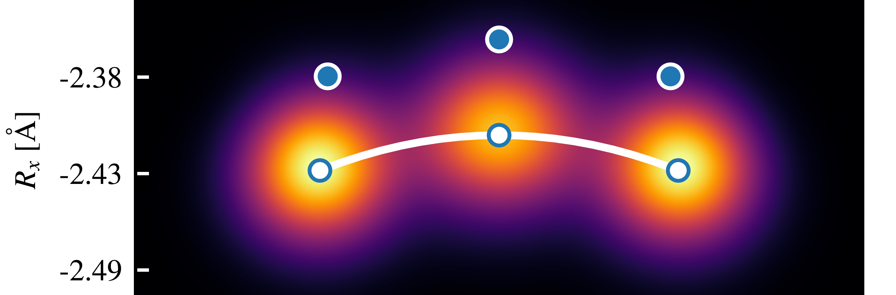

[](https://arxiv.org/abs/2507.08996)


### 🧪 Quantum NEO Dynamics

A repository to accompany the paper [_Approximate quantum circuit compilation for proton-transfer kinetics on quantum processors_](https://doi.org/10.48550/arXiv.2507.08996).

**Authors:** Arseny Kovyrshin, Dilhan Manawadu, Edoardo Altamura, George Pennington, Benjamin Jaderberg, Sebastian Brandhofer, Anton Nykänen, Aaron Miller, Walter Talarico, Stefan Knecht, Fabijan Pavošević, Alberto Baiardi, Francesco Tacchino, Ivano Tavernelli, Stefano Mensa, Jason Crain, Lars Tornberg, Anders Broo


This repository provides:

* Quantum circuits and Hamiltonians modelling proton transfer dynamics as described in the paper.
* Sample Python scripts to perform simulations.
* Results and data supporting the findings in the paper.

### 📁 Directory structure
```
.
├── data
│   ├── backends
│   │   ├── ibm_fez_*.properties.json
│   ├── circ
│   │   ├── aqc
│   │   │   ├── aqc-*.qpy
│   │   ├── product
│   │   │   ├── product-*.qpy
│   │   └── vqe
│   │       ├── vqe-*.qpy
│   ├── ham
│   │   ├── hamiltonian_*.json
│   └── targets
│       ├── ibm_fez_*.target.pkl
├── figures
│   ├── fig*.py
│   └── fig*.pdf
├── qneo.py
├── quantum_neo_dynamics
│   ├── decoder.py
│   └── paths.py
├── README.md
├── requirements.txt
├── results
│   ├── statevector_data.json
│   └── ZNE.csv
└── save-noise-models.py
```


### 🛠️ Installation

To set up the project locally, follow these steps:

1. Clone the repository:
   ```bash
   git clone https://github.com/stfc/quantum-neo-dynamics.git
   cd quantum-neo-dynamics
   ```
2. Create a virtual environment using Python 3.11:
   ```
   python3.11 -m venv venv
   ```
3. Activate the virtual environment:
   -On Linux/macOS
   ```
   source venv/bin/activate
   ```
   -On Windows
   ```
   venv\Scripts\activate
   ```
4. Install the required dependencies
   ```
   pip install -r requirements.txt
   ```
   
### 🚀 Running simulations

## Statevector simulations

* To run the main programme, make sure you have Python installed and the required dependencies set up (see the Installation section). Then, to perform statevector simulations, execute `qneo.py` as
```
python qneo.py -m <method> -a <approximation> -s <state>
```

## Noisy simulations

* To perform simulations with device noise models, execute `qneo.py` with the arguments
```
python qneo.py -m <method>  -a <approximation> -s <state> -b 1 -t <target> -p <props> -nsf <noisescalefactor> -ns <numshots>
```
* `target` and `props` are found in `data/targets` and `data/backends` respectively. Custom noise models can be generated by executing `save-noise-models.py` as
```
python save-noise-models.py -y <year> -m <month> -d <day> -H <hour> -M <minutes> -S <seconds>
```
## 👥 Authors

- [@dilhanm](https://github.com/DilhanM)
- [@edoaltamura](https://github.com/edoaltamura)
- [@arseny-qc](https://github.com/arseny-qc)
- [@GeorgePennington](https://github.com/GeorgePennington)
- [@bjader](https://github.com/bjader)

> [!NOTE]
> If you use this repository or its data in your work, we kindly request you to cite our paper with the following `bibtex` handle ([CITATION.bib](./CITATION.bib)):
> ```bibtex
> @ARTICLE{2025arXiv250708996K,  
>  author = {{Kovyrshin}, Arseny and {Manawadu}, Dilhan and {Altamura}, Edoardo and {Pennington}, George and {Jaderberg}, Benjamin and {Brandhofer}, Sebastian and {Nyk{\"a}nen}, Anton and {Miller}, Aaron and {Talarico}, Walter and {Knecht}, Stefan and {Pavo{\v{s}}evi{\'c}}, Fabijan and {Baiardi}, Alberto and {Tacchino}, Francesco and {Tavernelli}, Ivano and {Mensa}, Stefano and {Crain}, Jason and {Tornberg}, Lars and {Broo}, Anders},  
>  title = "{Approximate quantum circuit compilation for proton-transfer kinetics on quantum processors}",  
>  journal = {arXiv e-prints},  
>  year = 2025,  
>  month = jul,  
>  eprint = {2507.08996},  
>  archivePrefix = {arXiv},  
>  primaryClass = {quant-ph},
> adsurl = {https://ui.adsabs.harvard.edu/abs/2025arXiv250708996K},
> adsnote = {Provided by the SAO/NASA Astrophysics Data System}
> }
> ```

## 🕒 Version History

* v0.1 - Initial Release

